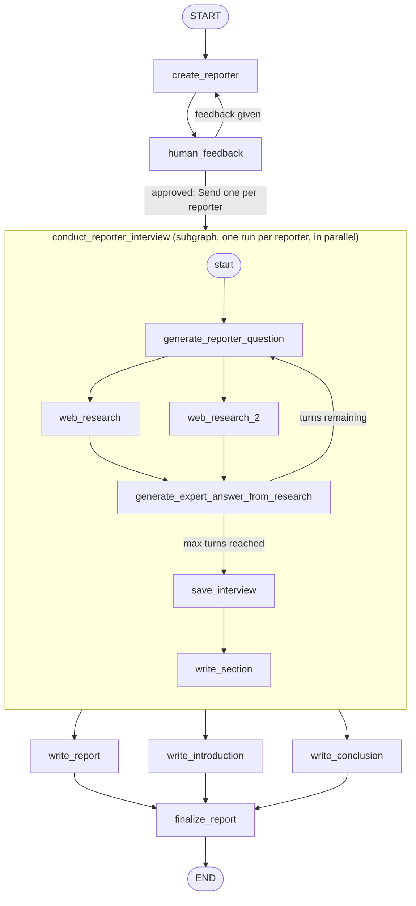

# Research Agent 2

A multi-agent research pipeline built with [LangGraph](https://langchain-ai.github.io/langgraph/). Give it a topic, and it generates a panel of AI "reporters" (each with their own angle), lets you review/approve them, then runs each reporter through a real web-search-backed interview with an "expert," and finally compiles all their findings into one written report — complete with introduction, conclusion, and cited sources.

## What it actually does

1. **Generate reporters** — given a topic, an LLM proposes a small panel of reporters, each with a distinct profile (name, institution, role, focus area)
2. **Human review (human-in-the-loop)** — the reporter panel is presented back to you. Approve it, or give feedback to regenerate
3. **Parallel interviews** — once approved, every reporter independently "interviews" an expert:
   - the reporter asks a question based on their profile
   - the question is turned into a web search query and run against [Tavily](https://tavily.com/)
   - an "expert" LLM answers using only the real search results, with citations
   - this repeats for a fixed number of turns, with each new question built on the growing conversation
   - the full back-and-forth is saved as a transcript, and turned into a written report section
4. **Report assembly** — once every reporter's interview is done, their sections are merged, and separate LLM calls write a unifying introduction, a consolidated body, and a conclusion
5. **Final report** — introduction + body + conclusion + a deduplicated source list, combined into one final markdown document

All reporter interviews run **in parallel**, not one after another — the number of reporters is only known at runtime, so this uses LangGraph's `Send` API to fan out dynamically.

## Why it's built this way

This isn't an open-ended chatbot graph that loops forever waiting on user input. It's a **bounded pipeline**: a fixed number of steps that runs once, produces one final artifact (the report), and stops. The only place a human is involved is the one approval checkpoint after reporters are generated.

## Architecture

The project is three separate LangGraph graphs, composed together:

| Graph | File | Role |
|---|---|---|
| `create_reporter` | `src/create_reporter_graph.py` | Generates reporters + human approval loop |
| `answer_reporter_question` | `src/answer_reporter_question_graph.py` | One reporter's full interview (question → search → answer → loop → write section) |
| `research_graph` | `src/research_graph.py` | The outer graph — wires the two above together, fans out interviews in parallel, assembles the final report |

### Outer graph (`research_graph`)



**How to read the fan-out:** after `human_feedback` approves the panel, `initiate_all_interviews` (an edge function) returns one `Send("conduct_reporter_interview", {...})` per approved reporter — not a single next node. LangGraph spins up one independent, parallel run of the interview subgraph per reporter, each seeded with just that reporter's profile. When every parallel run finishes, their individual report sections are merged back into one shared list (`sections`) via a LangGraph reducer, which is what `write_report`/`write_introduction`/`write_conclusion` then read from.

## Tech stack

- **LangGraph** — graph orchestration, state management, human-in-the-loop `interrupt()`, dynamic parallel fan-out via `Send`
- **LangChain** — LLM invocation, structured output, message types
- **OpenAI (gpt-4o-mini)** — reporter generation, question generation, answer generation, report writing
- **Tavily** — real web search for the expert's answers
- **uv** — dependency management

## Running it

```bash
uv sync
```

Create a `.env` with:
```
OPENAI_API_KEY=...
TAVILY_API_KEY=...
```

Then launch LangGraph Studio locally:
```bash
uv run langgraph dev
```

This exposes all three graphs above (`create_reporter`, `answer_reporter_question`, `research_graph`) — `research_graph` is the full end-to-end pipeline; the other two are useful for testing each stage in isolation.

Run `research_graph` with an initial state like:
```json
{
  "topic": "The role of mathematics in modern technology",
  "max_reporters": 3
}
```

The graph will pause at the human-feedback step and wait for input — approve with anything like `"okay"`/`"perfect"`/empty input, or type feedback to regenerate the reporter panel.
